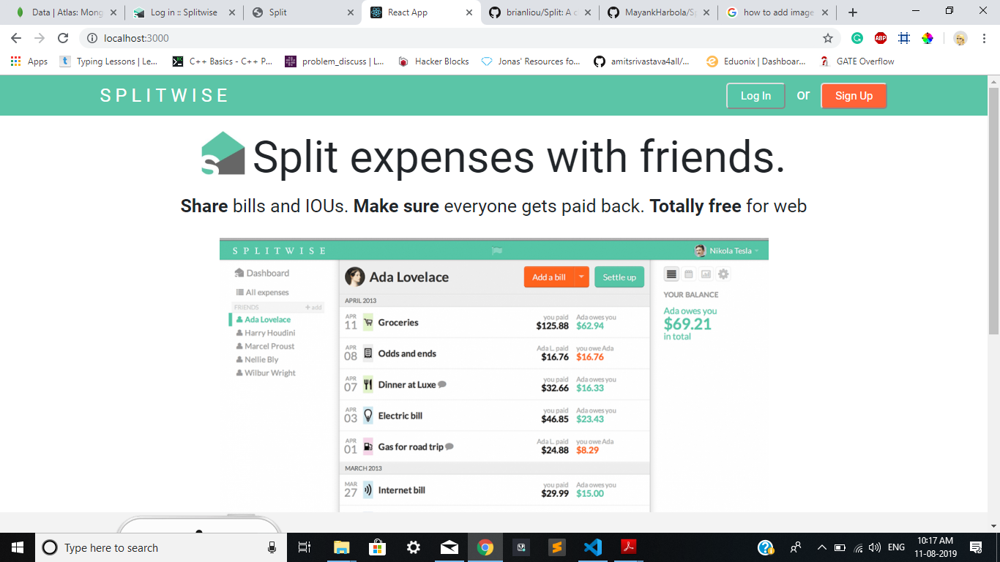
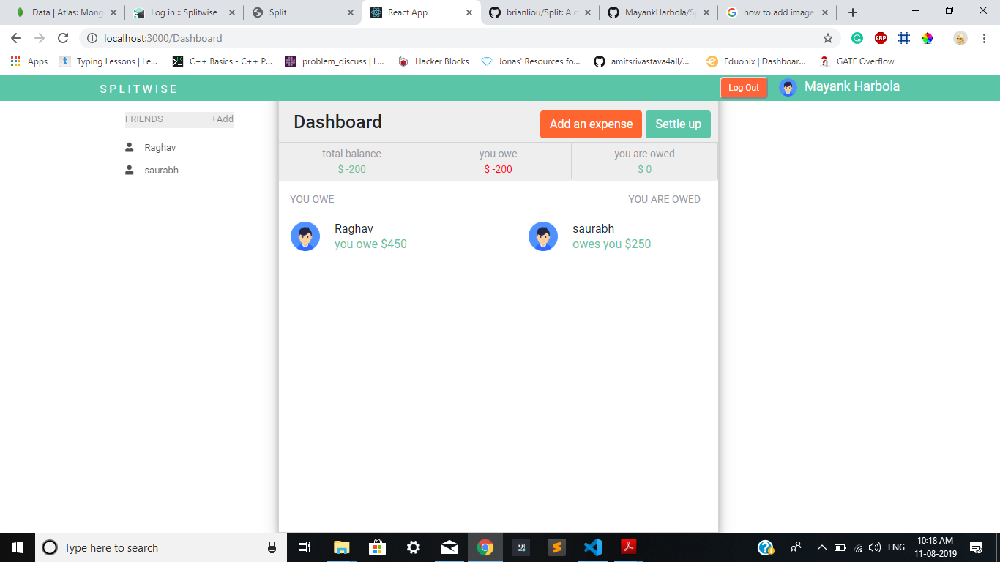
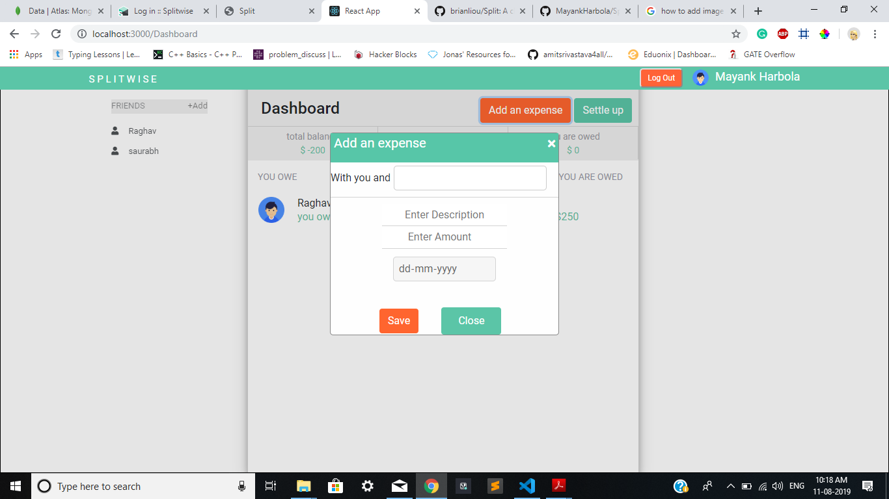
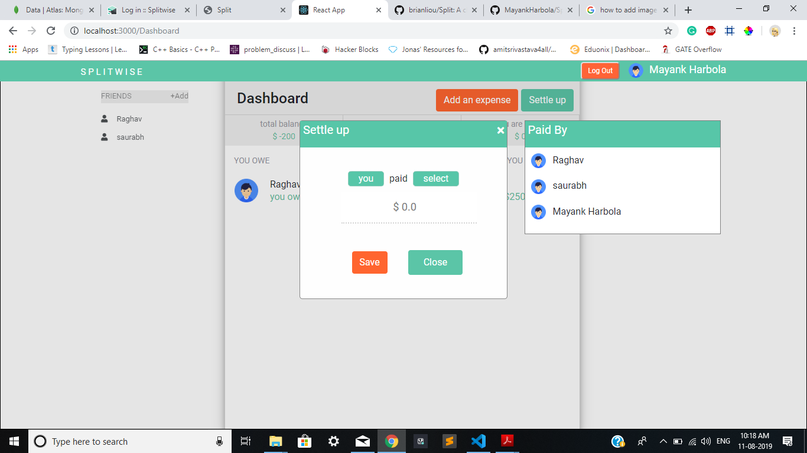

# Splitwise-Clone
Splitwise is a bill spliting application https://secure.splitwise.com, Here I have made a clone by using MERN stack

## How to use

```
Use npm install to install all the dependencies. (In Terminal)
1. cd/client
   npm install
   
2. cd/server
   npm install
   
Use node command to start server side server
3. cd/server
   node app.js
   
Use npm start to start the client side sever . (In another Terminal)
4. cd/client
   npm start
```

And point your browser to `http://localhost:3000`.

### Homepage


### Dashboard


### Add an Expense


### settle Up

